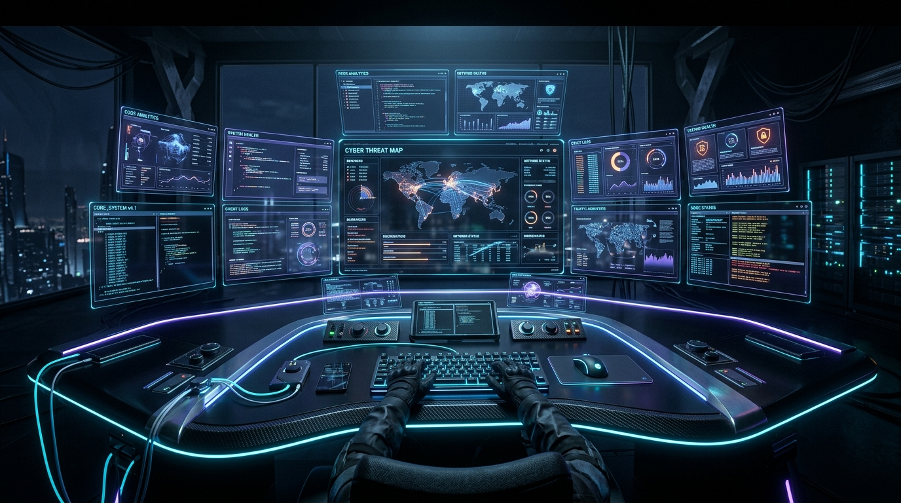
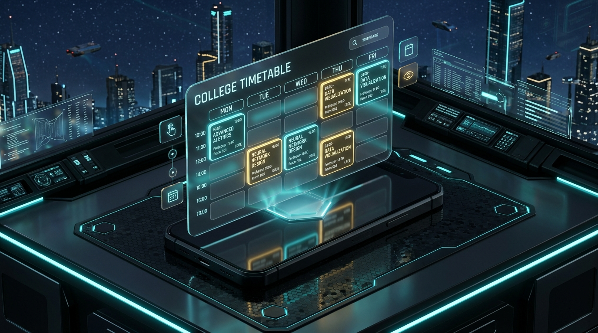
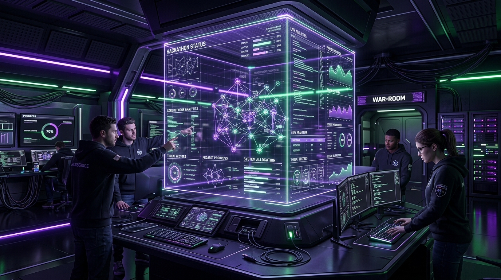
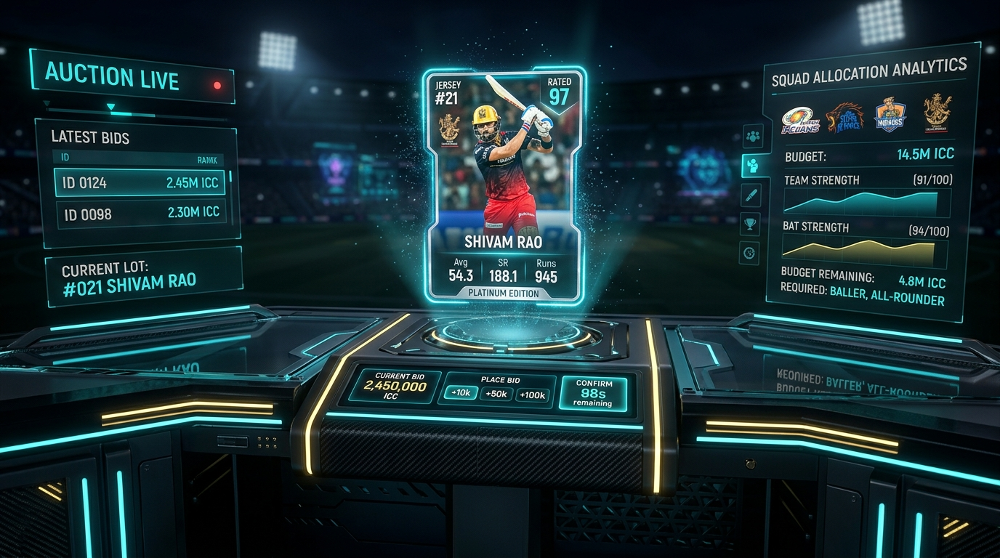
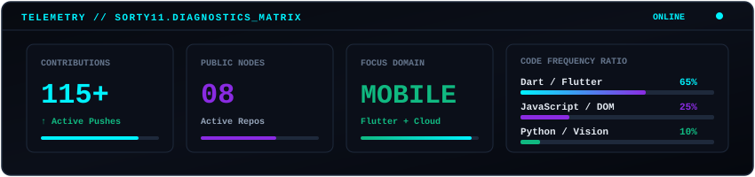
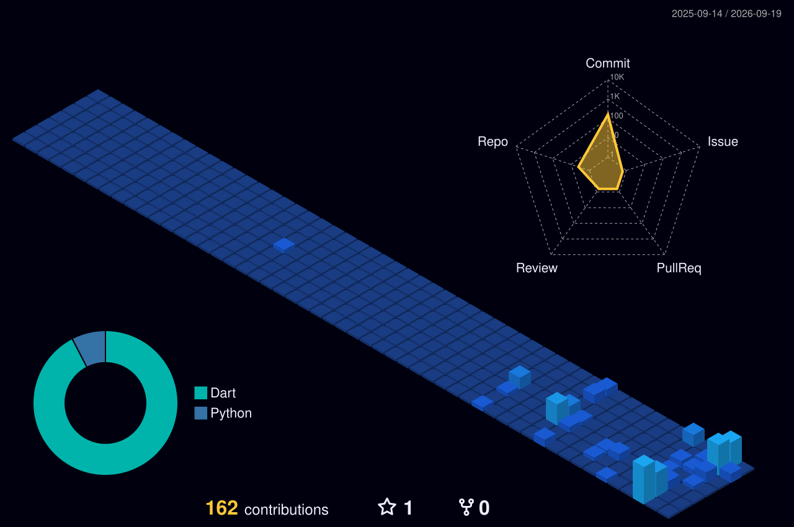

<div align="center">

  <!-- 3D Cinematic Command Center Banner -->
  

  <br/><br/>

  <!-- Tactical HUD Identity Badge -->
  

  <br/><br/>

  <!-- Quick Telemetry Indicators -->
  <p align="center">
    
    
    
    
    <a href="mailto:sorty797@gmail.com"></a>
  </p>

</div>

---

### ⚡ Operational Status // Command Dashboard

```yaml
system_diagnostics:
  operator      : "Sorty (sorty11)"
  domain        : "Computer Engineering • Mobile Architecture • Real-Time Systems"
  methodology   : "Build actual products, benchmark continuously, iterate relentlessly"
  flagship      : "Schedly [College Timetable & FCM Outbox Broadcast Worker]"
  hackathon     : "Fateheen [Smart India Hackathon Team Engineering]"
  r_and_d       : "AirControl [OpenCV + MediaPipe Vision Navigation]"
  philosophy    : "Talk is cheap. Show me the code that eliminates real-world friction."
```

---

### 🏆 Featured Deployments & Projects

<!-- Tier 1 Flagship: Schedly -->
<table>
  <tr>
    <td width="100%">
      <div align="center">
        <a href="https://github.com/sorty11/Schedly">
          
        </a>
      </div>
      <h3>📱 <a href="https://github.com/sorty11/Schedly">Schedly — College Timetable &amp; Real-Time Broadcast Engine</a></h3>
      <p>
        Production-grade academic platform built for college campuses. Implements an atomic <strong>Transactional Outbox Pattern</strong> via Cloud Firestore and a Node.js polling daemon that validates student credentials and broadcasts to <strong>FCM Topics</strong> (e.g. <code>division_A</code>, <code>role_CR</code>). This guarantees 100% reliable, zero-loss push notifications without device-token tracking overhead.
      </p>
      <p>
        
        
        
        
        
        
      </p>
      <p>
        <a href="https://github.com/sorty11/Schedly"><strong>View Schedly Repository &amp; Architecture →</strong></a>
      </p>
    </td>
  </tr>
</table>

<br/>

<!-- Tier 2 Projects: 3 Column Grid -->
<table>
  <tr>
    <td width="33%" valign="top">
      <a href="https://github.com/sorty11/Fateheen">
        
      </a>
      <h4>🛡️ <a href="https://github.com/sorty11/Fateheen">Fateheen (SIH Project)</a></h4>
      <p>
        Competitive engineering solution architected for the <strong>Smart India Hackathon</strong>. Built by our team to tackle mission-critical problem statements through rapid, high-pressure collaborative development.
      </p>
      <p>
        
        
      </p>
      <p><a href="https://github.com/sorty11/Fateheen"><strong>Explore Project →</strong></a></p>
    </td>
    <td width="33%" valign="top">
      <a href="https://github.com/sorty11/aircontrol">
        
      </a>
      <h4>🖐️ <a href="https://github.com/sorty11/aircontrol">AirControl</a></h4>
      <p>
        Touchless computer-vision interaction system using real-time hand-landmark triangulation to execute air-mouse navigation, optical pinching, and audio modulation without physical peripherals.
      </p>
      <p>
        
        
        
      </p>
      <p><a href="https://github.com/sorty11/aircontrol"><strong>Explore Project →</strong></a></p>
    </td>
    <td width="33%" valign="top">
      <a href="https://github.com/sorty11/cricket-player-auction">
        
      </a>
      <h4>🏏 <a href="https://github.com/sorty11/cricket-player-auction">Cricket Player Auction</a></h4>
      <p>
        Interactive sports auction simulation terminal with live purse deduction, bidding increments, squad quota validators, and automated team budget analytics.
      </p>
      <p>
        
        
        
      </p>
      <p><a href="https://github.com/sorty11/cricket-player-auction"><strong>Explore Project →</strong></a></p>
    </td>
  </tr>
</table>

---

### 🛠️ Technical Armory & Toolchain

<div align="center">

| Subsystem | Technologies & Frameworks | Focus Level |
| :--- | :--- | :--- |
| **Core Languages** | `Dart` • `JavaScript` • `Python` • `C / C++` | Daily Production |
| **Mobile & Frontend** | `Flutter` • `Material Design 3` • `Responsive Layouts` • `HTML5 / CSS3` | Advanced Engineering |
| **Backend & Cloud** | `Node.js` • `Express` • `Cloud Firestore` • `Firebase Auth` • `FCM Topics` | Cloud & Real-Time Ops |
| **Tooling & Environments** | `Git & GitHub Actions` • `VS Code` • `Android Studio` • `Postman` • `Linux` | Daily Workflow |
| **Exploring & Creative Tech** | `OpenCV` • `MediaPipe` • `3D Web Graphics` • `AI-Augmented Workflows` | Active Prototyping |

</div>

---

### 📡 Telemetry Matrix & GitHub Activity

<div align="center">

  <!-- Self-Hosted Obsidian Diagnostic Card -->
  

  <br/><br/>

  <!-- 3D Isometric Contribution Skyline (Auto-Generated by GitHub Action) -->
  

  <br/><br/>

  <!-- Autonomous Contribution Snake -->
  <picture>
    <source media="(prefers-color-scheme: dark)" srcset="https://raw.githubusercontent.com/sorty11/sorty11/output/github-contribution-grid-snake-dark.svg">
    <source media="(prefers-color-scheme: light)" srcset="https://raw.githubusercontent.com/sorty11/sorty11/output/github-contribution-grid-snake.svg">
    
  </picture>

</div>

---

### 🎮 The Rig & Philosophy

```
[SYSTEM_CONSOLE]
> operator: "sorty11"
> motto: "Talk is cheap. Show me the code that solves a real human problem."
> downtime: "Valorant competitive lobby • Exploring 3D game engines & emulation"
```

---

<div align="center">
  <sub>⚡ Designed &amp; Maintained by <strong>Sorty</strong> // Engineered for Performance &amp; Real-World Utility ⚡</sub>
</div>
