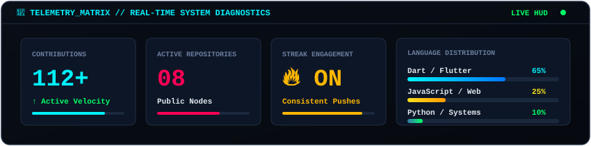

<div align="center">

  <!-- Self-Hosted Animated Cyberdeck Header (Bulletproof / Zero Downtime) -->
  

  <br/><br/>

  <!-- Dynamic Typing Subtitle -->
  <a href="https://github.com/sorty11">
    
  </a>

  <br/>

  <!-- Cyber System Badges -->
  <p align="center">
    
    
    
    <a href="mailto:sorty797@gmail.com"></a>
  </p>

</div>

---

### 💻 `neofetch --sorty`

```ini
   ███████╗ ██████╗ ██████╗ ████████╗██╗   ██╗     OS       : AI-Augmented Linux / Windows Kernel
   ██╔════╝██╔═══██╗██╔══██╗╚══██╔══╝╚██╗ ██╔╝     HOST     : Neural Cyberdeck v2.6
   ███████╗██║   ██║██████╔╝   ██║    ╚████╔╝      ROLE     : AI-Native Systems Builder & Orchestrator
   ╚════██║██║   ██║██╔══██╗   ██║     ╚██╔╝       CORE     : Flutter • Dart • Node.js • Firebase
   ███████║╚██████╔╝██║  ██║   ██║      ██║        METHOD   : 100% Vibe-Coded / High-Velocity Prototyping
   ╚══════╝ ╚═════╝ ╚═╝  ╚═╝   ╚═╝      ╚═╝        PHILOSOPHY: "Talk is cheap. Show me the prompt & the deployed app."
```

---

### ⚙️ Production Modules & Architecture

```yaml
nodes:
  - module: "01 // SCHEDLY"
    type: "Campus Timetable & Real-Time Alert Distribution"
    engine: "Flutter (Dart) + Firebase Firestore + Node.js Worker"
    architecture: "Atomic Transactional Outbox (Guarantees 0-loss push broadcasts via FCM Topics)"
    endpoint: "https://github.com/sorty11/Schedly"

  - module: "02 // CRICKET AUCTION ENGINE"
    type: "Real-time Bidding & Budgeting Simulator"
    engine: "JavaScript + DOM State Machine"
    endpoint: "https://github.com/sorty11/cricket-player-auction"

  - module: "03 // AIRCONTROL"
    type: "Computer Vision Gesture Interaction"
    engine: "Python + OpenCV + MediaPipe"
    status: "R&D Prototype"
```

---

### 🛠️ Armory & Toolchain

<div align="center">

| Subsystem | Stack |
| :--- | :--- |
| **Mobile & Frontend** | <a href="https://skillicons.dev"></a> |
| **Backend & Cloud** | <a href="https://skillicons.dev"></a> |
| **Tools & AI Engine** | <a href="https://skillicons.dev"></a> |

</div>

---

### 📡 System Telemetry & Metrics (Bulletproof Vector HUD)

<div align="center">

  <!-- Self-Hosted Zero-Downtime Telemetry Card -->
  

  <br/><br/>

  <!-- GitHub Streak Card -->
  

</div>

---

### 🐍 Neural Grid Activity (Autonomous Snake Worker)

<div align="center">
  <picture>
    <source media="(prefers-color-scheme: dark)" srcset="https://raw.githubusercontent.com/sorty11/sorty11/output/github-contribution-grid-snake-dark.svg">
    <source media="(prefers-color-scheme: light)" srcset="https://raw.githubusercontent.com/sorty11/sorty11/output/github-contribution-grid-snake.svg">
    
  </picture>
</div>

---

<div align="center">
  <code>⚡ SYSTEM STATUS: 0 ERRORS // 100% OPERATIONAL // SORTY.DEV ⚡</code>
</div>
