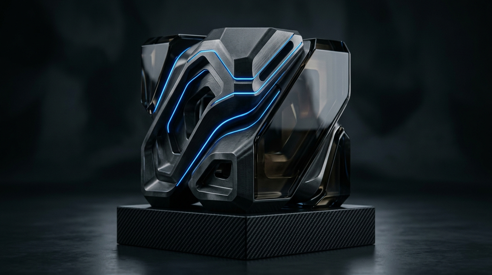

<table>
  <tr>
    <td width="56%" valign="middle">
      
      <br/><br/>
      <sub>ENGINEER // PRODUCT BUILDER</sub>
      <h1>SORTY11</h1>
      <p>
        Building high-reliability software across mobile, cloud, computer vision, and emerging technologies. Focused on turning complex systems into quiet, high-utility products.
      </p>
      <p>
        <a href="https://github.com/sorty11"><strong>GitHub ↗</strong></a> &nbsp;&nbsp;·&nbsp;&nbsp;
        <a href="https://linkedin.com/in/YOUR_LINKEDIN_HERE"><strong>LinkedIn ↗</strong></a> &nbsp;&nbsp;·&nbsp;&nbsp;
        <a href="mailto:sorty797@gmail.com"><strong>Email ↗</strong></a> &nbsp;&nbsp;·&nbsp;&nbsp;
        <a href="https://schedly-production.web.app"><strong>Schedly Live ↗</strong></a>
      </p>
      <p>
        <sub>MUMBAI, IN &nbsp;·&nbsp; NMIMS B.TECH CE &nbsp;·&nbsp; EST. 2024</sub>
      </p>
    </td>
    <td width="44%" align="center" valign="middle">
      
    </td>
  </tr>
</table>

---

### `01` / CURRENTLY BUILDING

<table>
  <tr>
    <td width="56%" valign="middle">
      <div align="right"><sub>PRODUCTION DEPLOYMENT // v1.1.0</sub></div>
      <h3>📱 <a href="https://schedly-production.web.app">Schedly — College Timetable &amp; Notification Infrastructure</a></h3>
      <p>
        A campus-wide platform engineered to eliminate schedule friction. Implements an atomic <strong>Transactional Outbox Pattern</strong> between Cloud Firestore and an adaptive background Node.js daemon, dispatching real-time updates directly to <strong>FCM Topics</strong> (divisions, lab batches, and student representatives). Guarantees zero-loss alert delivery across entire student bodies without device-token tracking overhead.
      </p>
      <p>
        <sub><strong>STACK</strong> &nbsp;·&nbsp; Flutter · Dart · Cloud Firestore · Node.js Worker · Firebase FCM</sub>
      </p>
      <p>
        <a href="https://schedly-production.web.app"><strong>[ View Live Web App ↗ ]</strong></a> &nbsp;&nbsp;&nbsp;
        <a href="https://github.com/sorty11/Schedly"><strong>[ Architecture &amp; Repository ↗ ]</strong></a>
      </p>
    </td>
    <td width="44%" align="center" valign="middle">
      <a href="https://schedly-production.web.app">
        
      </a>
      <div align="right"><sub>LIVE APPLICATION</sub></div>
    </td>
  </tr>
</table>

---

### `02` / SELECTED WORK

<table>
  <tr>
    <td width="33%" valign="top">
      <a href="https://github.com/sorty11/Fateheen">
        
      </a>
      <br/><br/>
      <sub>02 // SYSTEMS</sub>
      <h4><a href="https://github.com/sorty11/Fateheen">Fateheen</a></h4>
      <p>Mission-critical systems engineering platform architected for the <strong>Smart India Hackathon (SIH)</strong> under intensive competitive constraints.</p>
      <p><sub><code>Full-Stack</code> · <code>Cloud Architecture</code></sub></p>
      <p><a href="https://github.com/sorty11/Fateheen"><strong>Repository ↗</strong></a></p>
    </td>
    <td width="33%" valign="top">
      <a href="https://github.com/sorty11/aircontrol">
        
      </a>
      <br/><br/>
      <sub>03 // COMPUTER VISION</sub>
      <h4><a href="https://github.com/sorty11/aircontrol">AirControl</a></h4>
      <p>Touchless interaction system leveraging real-time hand-landmark triangulation to execute air-mouse navigation, optical pinching, and audio modulation.</p>
      <p><sub><code>Python</code> · <code>OpenCV</code> · <code>MediaPipe</code></sub></p>
      <p><a href="https://github.com/sorty11/aircontrol"><strong>Repository ↗</strong></a></p>
    </td>
    <td width="33%" valign="top">
      <a href="https://github.com/sorty11/cricket-player-auction">
        
      </a>
      <br/><br/>
      <sub>04 // SIMULATION ENGINE</sub>
      <h4><a href="https://github.com/sorty11/cricket-player-auction">Cricket Auction</a></h4>
      <p>Real-time sports auction bidding simulator with dynamic purse deduction, team squad quota constraints, and automated roster valuation analytics.</p>
      <p><sub><code>JavaScript</code> · <code>HTML5</code> · <code>CSS3</code></sub></p>
      <p><a href="https://github.com/sorty11/cricket-player-auction"><strong>Repository ↗</strong></a></p>
    </td>
  </tr>
</table>

---

### `03` / TECHNICAL STACK

```ini
  CORE         ::  Dart · Flutter · JavaScript · Python · C / C++
  PRODUCT      ::  Node.js · Express · Cloud Firestore · Firebase Auth
  VISION & AI  ::  OpenCV · MediaPipe · AI-Augmented Pipelines
  TOOLCHAIN    ::  Git · GitHub Actions · VS Code · Android Studio · Linux
  EXPLORING    ::  Distributed Messaging · 3D Web Graphics · Systems Engineering
```

---

### `04` / CODEBASE RATIO

<div align="center">
  
</div>

---

### `05` / GITHUB ACTIVITY

<!-- The Single 3D Isometric Contribution Monolith -->
<div align="center">
  
</div>

---

### `06` / IDENTITY & FOCUS

<p>
  <code>Product Engineering</code> &nbsp;·&nbsp;
  <code>Mobile Architecture</code> &nbsp;·&nbsp;
  <code>Computer Vision</code> &nbsp;·&nbsp;
  <code>Smart India Hackathon</code> &nbsp;·&nbsp;
  <code>Competitive Gaming (Valorant)</code> &nbsp;·&nbsp;
  <code>3D Graphics &amp; Emulation</code>
</p>

---

<div align="center">
  <sub>Designed with restraint, precision &amp; depth · Sorty © 2026</sub>
</div>
