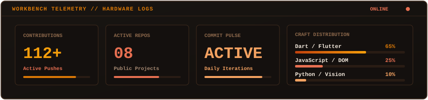

<div align="center">

  <!-- Handcrafted Vintage Rusty/Amber CRT Banner -->
  

  <br/><br/>

  <!-- Subtle Amber Monospace Subtitle -->
  <a href="https://github.com/sorty11">
    
  </a>

  <br/>

  <!-- Warm Vintage Badges -->
  <p align="center">
    
    
    
    <a href="mailto:sorty797@gmail.com"></a>
  </p>

</div>

---

### 🪵 The Workbench

```
╭────────────────────────────────────────────────────────────────────────╮
│  "Most of my time is spent tinkering with code, breaking things,      │
│   and putting them back together until they actually work."            │
╰────────────────────────────────────────────────────────────────────────╯
```

Hey, I'm **Sorty** 👋

I like building practical, no-nonsense software for mobile, web, and hardware. Instead of getting stuck in theoretical debates, I prefer picking up tools, prototyping quickly, and launching things that solve actual everyday friction.

* 📱 **Currently focused on**: Scaling [Schedly](https://github.com/sorty11/Schedly) — a campus timetable and instant alert platform.
* 🛠️ **Favorite workflow**: Flutter on the front, Firebase / Node on the back, and plenty of coffee in between.
* 🔍 **Exploring**: Offline-first mobile caching, real-time message brokering, and computer vision gestures.

---

### 📦 Handcrafted Projects

| Project | Description | Stack |
| :--- | :--- | :--- |
| **[📱 Schedly](https://github.com/sorty11/Schedly)** | College timetable & announcements engine. Built with an atomic **Transactional Outbox** pattern to make sure campus-wide push notifications never get lost. | `Flutter` `Dart` `Firebase` `Node.js` |
| **[🏏 Cricket Player Auction](https://github.com/sorty11/cricket-player-auction)** | Interactive real-time bidding simulator with live budget calculations, team rosters, and auction dynamics. | `JavaScript` `HTML5` `CSS3` |
| **[🖐️ AirControl](https://github.com/sorty11/aircontrol)** | Computer vision prototype tracking hand landmarks to control computer cursor and audio in the air. | `Python` `OpenCV` `MediaPipe` |

---

### 🧰 Tools & Workshop Kit

<div align="center">

| Area | Tools & Technologies |
| :--- | :--- |
| **Mobile & Frontend** | <a href="https://skillicons.dev"></a> |
| **Data & Services** | <a href="https://skillicons.dev"></a> |
| **Workbench & OS** | <a href="https://skillicons.dev"></a> |

</div>

---

### 📜 Workbench Logs & Telemetry

<div align="center">

  <!-- Self-Hosted Vintage Rust Telemetry HUD -->
  

  <br/><br/>

  <!-- Gruvbox / Warm Amber Streak Counter -->
  

</div>

---

### 🐍 The Contribution Grid

<div align="center">
  <picture>
    <source media="(prefers-color-scheme: dark)" srcset="https://raw.githubusercontent.com/sorty11/sorty11/output/github-contribution-grid-snake-dark.svg">
    <source media="(prefers-color-scheme: light)" srcset="https://raw.githubusercontent.com/sorty11/sorty11/output/github-contribution-grid-snake.svg">
    
  </picture>
</div>

---

<div align="center">
  <sub>🪵 Handcrafted by Sorty • Built with patience &amp; curiosity • Est. 2024</sub>
</div>
