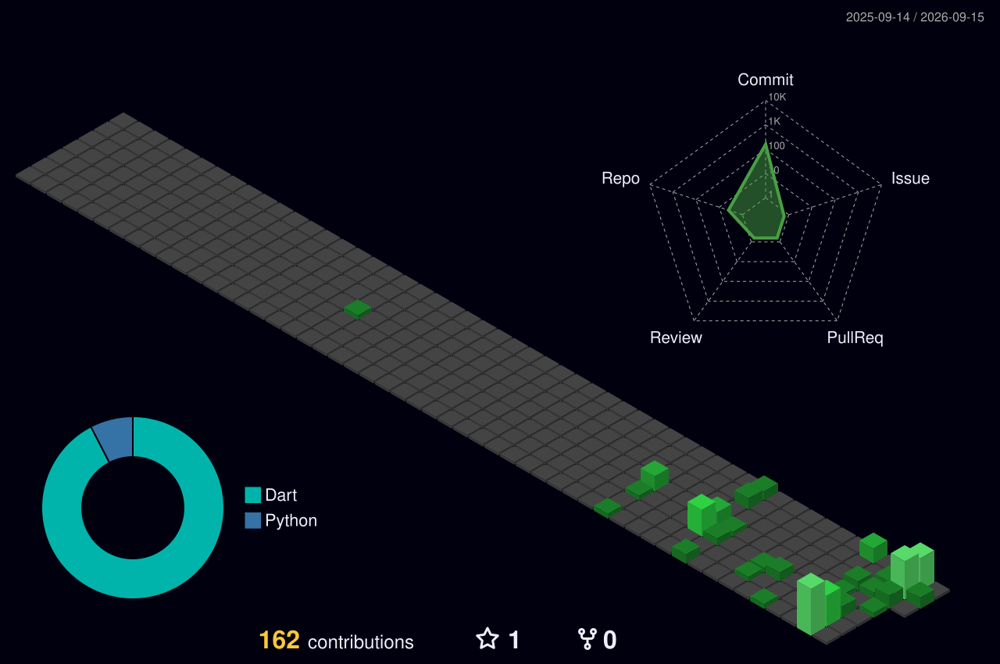

# Sorty
**Software Engineer · Builder**

Building practical software across mobile, cloud, computer vision, and emerging technologies. Focused on high-reliability architectures, offline-first applications, and systems that solve real everyday friction.

[GitHub](https://github.com/sorty11) &nbsp;·&nbsp; [LinkedIn](https://linkedin.com/in/YOUR_LINKEDIN_HERE) &nbsp;·&nbsp; [Email](mailto:sorty797@gmail.com) &nbsp;·&nbsp; [Schedly Web App](https://schedly-production.web.app)

---

### Currently Building

#### 📱 [Schedly](https://github.com/sorty11/Schedly) — College Timetable & Real-Time Notification Platform
A high-reliability academic platform built for universities. It implements an atomic **Transactional Outbox Pattern** with Cloud Firestore and an adaptive Node.js polling worker to broadcast campus-wide and division-specific updates directly to **FCM Topics** (e.g. `division_A`, `batch_A1`, `role_CR`). This guarantees zero-loss alert delivery without the overhead of tracking individual device tokens.

* **Stack**: Flutter, Dart, Cloud Firestore, Node.js Worker, FCM Topics
* **Status**: Production (v1.1.0)
* **Access**: [View Live Web App →](https://schedly-production.web.app) &nbsp;·&nbsp; [View GitHub Repository →](https://github.com/sorty11/Schedly)

---

### Selected Projects

<table>
  <tr>
    <td width="50%" valign="top">
      <h4>📱 <a href="https://github.com/sorty11/Schedly">Schedly</a></h4>
      <p>College timetable and notification system built with an atomic outbox worker for guaranteed campus-wide broadcast delivery.</p>
      <p><code>Flutter</code> · <code>Dart</code> · <code>Firestore</code> · <code>Node.js</code></p>
      <p><strong>Status:</strong> Production &nbsp;|&nbsp; <a href="https://schedly-production.web.app">Live App →</a> · <a href="https://github.com/sorty11/Schedly">Code →</a></p>
    </td>
    <td width="50%" valign="top">
      <h4>🛡️ <a href="https://github.com/sorty11/Fateheen">Fateheen</a></h4>
      <p>Competitive engineering solution architected for the <strong>Smart India Hackathon (SIH)</strong>, built under tight deadlines to solve mission-critical problem statements.</p>
      <p><code>Full-Stack</code> · <code>Cloud Architecture</code> · <code>Hackathon</code></p>
      <p><strong>Status:</strong> Team Project &nbsp;|&nbsp; <a href="https://github.com/sorty11/Fateheen">Code →</a></p>
    </td>
  </tr>
  <tr>
    <td width="50%" valign="top">
      <h4>🖐️ <a href="https://github.com/sorty11/aircontrol">AirControl</a></h4>
      <p>Touchless interaction system using real-time computer-vision hand-landmark triangulation to execute cursor navigation, optical pinching, and audio modulation.</p>
      <p><code>Python</code> · <code>OpenCV</code> · <code>MediaPipe</code></p>
      <p><strong>Status:</strong> Active Prototype &nbsp;|&nbsp; <a href="https://github.com/sorty11/aircontrol">Code →</a></p>
    </td>
    <td width="50%" valign="top">
      <h4>🏏 <a href="https://github.com/sorty11/cricket-player-auction">Cricket Player Auction</a></h4>
      <p>Interactive sports auction simulation engine with real-time purse calculation, bidding validation, and automated squad allocation analytics.</p>
      <p><code>JavaScript</code> · <code>HTML5</code> · <code>CSS3</code></p>
      <p><strong>Status:</strong> Complete &nbsp;|&nbsp; <a href="https://github.com/sorty11/cricket-player-auction">Code →</a></p>
    </td>
  </tr>
</table>

---

### Technical Stack

```
Core           Dart · Flutter · JavaScript · Python · C / C++
Backend        Node.js · Express · Cloud Firestore · Firebase Auth
Vision & AI    OpenCV · MediaPipe · AI-Augmented Pipelines
Toolchain      Git · GitHub Actions · VS Code · Android Studio · Linux
Exploring      3D Web Graphics · Distributed Real-Time Messaging · Systems
```

---

### GitHub Activity

<!-- 3D Isometric Contribution Data Visualization -->
<div align="center">
  <picture>
    <source media="(prefers-color-scheme: dark)" srcset="./profile-3d-contrib/profile-night-green.svg">
    <source media="(prefers-color-scheme: light)" srcset="./profile-3d-contrib/profile-gitblock.svg">
    
  </picture>
</div>

---

### Contact

Feel free to reach out for project collaborations, technical discussions, or hackathons:

* **Email**: [sorty797@gmail.com](mailto:sorty797@gmail.com)
* **GitHub**: [@sorty11](https://github.com/sorty11)
* **LinkedIn**: [linkedin.com/in/YOUR_LINKEDIN_HERE](https://linkedin.com/in/YOUR_LINKEDIN_HERE)

<br/>

<div align="center">
  <sub>Designed with restraint & clarity · Sorty © 2026</sub>
</div>
