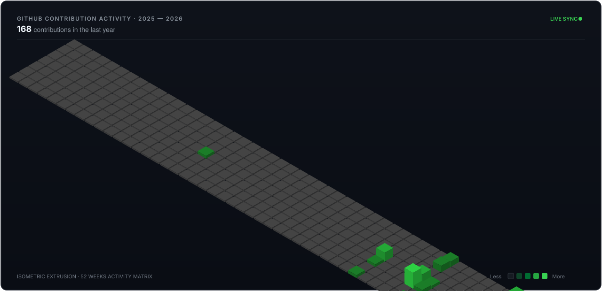

<table>
  <tr>
    <td width="58%" valign="middle">
      <sub>SOFTWARE ENGINEER · BUILDER</sub>
      <h1>Sorty</h1>
      <p>
        Building software across mobile, cloud, vision, and emerging technology. Focused on turning complex architectural challenges into quiet, high-utility products.
      </p>
      <p>
        <a href="https://github.com/sorty11"><strong>GitHub ↗</strong></a> &nbsp;&nbsp;·&nbsp;&nbsp;
        <a href="https://linkedin.com/in/YOUR_LINKEDIN_HERE"><strong>LinkedIn ↗</strong></a> &nbsp;&nbsp;·&nbsp;&nbsp;
        <a href="mailto:sorty797@gmail.com"><strong>Email ↗</strong></a> &nbsp;&nbsp;·&nbsp;&nbsp;
        <a href="https://schedly-production.web.app"><strong>Schedly Live ↗</strong></a>
      </p>
      <p>
        <sub>NMIMS B.TECH CE &nbsp;·&nbsp; MUMBAI, IN &nbsp;·&nbsp; EST. 2024</sub>
      </p>
    </td>
    <td width="42%" align="center" valign="middle">
      
    </td>
  </tr>
</table>

---

### `01` / CURRENTLY BUILDING

<table>
  <tr>
    <td width="58%" valign="middle">
      <sub>FLAGSHIP SYSTEM // v1.1.0</sub>
      <h2>Schedly</h2>
      <p><strong>College timetable and real-time notification infrastructure.</strong></p>
      <p>
        Engineered to eliminate schedule friction across university departments. Implements an atomic <strong>Transactional Outbox Pattern</strong> between Cloud Firestore and an adaptive background Node.js worker, routing alerts to <strong>FCM Topics</strong> (divisions, lab batches, and class representatives). Guarantees zero-loss broadcast delivery without the complexity of individual device token tracking.
      </p>
      <p>
        <sub><strong>STACK</strong> &nbsp;·&nbsp; Flutter · Dart · Cloud Firestore · Node.js Worker · Firebase FCM</sub>
      </p>
      <p>
        <a href="https://schedly-production.web.app"><strong>[ View Live Web App ↗ ]</strong></a> &nbsp;&nbsp;&nbsp;
        <a href="https://github.com/sorty11/Schedly"><strong>[ Architecture &amp; Source ↗ ]</strong></a>
      </p>
    </td>
    <td width="42%" align="center" valign="middle">
      <a href="https://schedly-production.web.app">
        
      </a>
      <div align="right"><sub>PRODUCTION SYSTEM</sub></div>
    </td>
  </tr>
</table>

---

### `02` / SELECTED WORK

<table>
  <tr>
    <td width="33%" valign="top">
      
      <br/><br/>
      <sub>02 // SYSTEMS</sub>
      <h4><a href="https://github.com/sorty11/Fateheen">Fateheen</a></h4>
      <p>Collaborative engineering solution architected for the <strong>Smart India Hackathon (SIH)</strong> under high-pressure competitive constraints.</p>
      <p><sub><code>Full-Stack</code> · <code>Cloud Architecture</code></sub></p>
      <p><a href="https://github.com/sorty11/Fateheen"><strong>Repository ↗</strong></a></p>
    </td>
    <td width="33%" valign="top">
      
      <br/><br/>
      <sub>03 // COMPUTER VISION</sub>
      <h4><a href="https://github.com/sorty11/aircontrol">AirControl</a></h4>
      <p>Touchless interaction system tracking hand landmarks in real time to drive air-mouse navigation, optical gestures, and audio modulation.</p>
      <p><sub><code>Python</code> · <code>OpenCV</code> · <code>MediaPipe</code></sub></p>
      <p><a href="https://github.com/sorty11/aircontrol"><strong>Repository ↗</strong></a></p>
    </td>
    <td width="33%" valign="top">
      
      <br/><br/>
      <sub>04 // SIMULATION ENGINE</sub>
      <h4><a href="https://github.com/sorty11/cricket-player-auction">Cricket Auction</a></h4>
      <p>Real-time sports auction bidding simulator featuring dynamic purse deductions, squad quota constraints, and automated roster valuation analytics.</p>
      <p><sub><code>JavaScript</code> · <code>HTML5</code> · <code>CSS3</code></sub></p>
      <p><a href="https://github.com/sorty11/cricket-player-auction"><strong>Repository ↗</strong></a></p>
    </td>
  </tr>
</table>

---

### `03` / TECHNICAL STACK

```ini
  CORE       ::  Dart · Flutter · JavaScript · Python · C / C++
  PRODUCT    ::  Node.js · Express · Cloud Firestore · Firebase Auth
  VISION     ::  OpenCV · MediaPipe
  TOOLING    ::  Git · GitHub Actions · VS Code · Android Studio · Linux
  EXPLORING  ::  Distributed Messaging · 3D Web Graphics · Computer Vision
```

---

### `04` / GITHUB ACTIVITY

<!-- The Single 3D Isometric Contribution Data Visualization -->
<div align="center">
  
</div>

---

### `05` / FOCUS & INTERESTS

<p>
  <code>Product Engineering</code> &nbsp;·&nbsp;
  <code>Mobile Architecture</code> &nbsp;·&nbsp;
  <code>Computer Vision</code> &nbsp;·&nbsp;
  <code>Hackathons (SIH)</code> &nbsp;·&nbsp;
  <code>3D Graphics</code> &nbsp;·&nbsp;
  <code>Competitive Gaming</code>
</p>

---

<div align="center">
  <sub>Designed with restraint, precision &amp; clarity · Sorty © 2026</sub>
</div>
